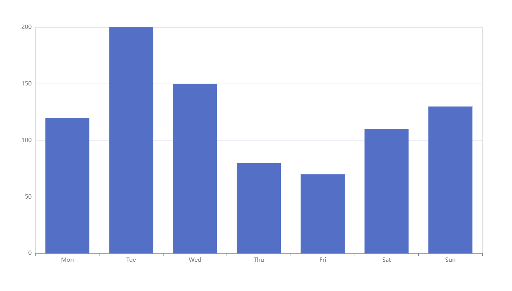

# Pancharts

一个用于生成精美 ECharts 可视化图表的 Python 库，完美支持 pandas 数据结构。

## 特性

- **无缝 Pandas 集成**：直接可视化 pandas Series 和 DataFrame，无需手动转换数据
- **简单的数据到图表映射**：直观的 API 将 pandas 数据结构映射到适当的图表类型
- **丰富的图表类型**：20+ 种图表类型，包括柱状图、折线图、散点图、饼图、漏斗图、词云图、旭日图、矩形树图、树图、3D 柱状图、图网络、桑基图、热力图、平行坐标图、雷达图、日历热图和地图
- **AI 驱动的配置修改**：使用 `modify_option()` 和 `patch_option()` 通过大语言模型修改图表配置
- **可定制的图表选项**：完全控制 ECharts 选项，支持深度合并
- **双重渲染方法**：
  - `render()`：保存为独立的 HTML 文件
  - `render_notebook()`：在 Jupyter Notebook 中直接显示
- **灵活的 ECharts 源**：支持本地和在线 ECharts CDN
- **地图可视化**：内置支持地理数据的地图图表

## 安装

```bash
pip install pancharts
```

## 快速开始

### 基本使用

## Pandas 数据结构到图表的映射

Pancharts 提供了专门的类，可以自动将 pandas 数据结构映射到适当的可视化图表：

### 1. `k_v`：单列索引 Series

用于具有单层索引的 pandas Series。

**支持的图表类型：**
- `bar()` - 柱状图
- `line()` - 折线图
- `scatter()` - 散点图
- `escatter()` - 特效散点图
- `pie()` - 饼图
- `funnel()` - 漏斗图
- `wordcloud()` - 词云图
- `calendar()` - 日历热图
- `map(map_name)` - 地图图表（需要 map_name 参数）

**示例：**

```python
import pandas as pd
from pancharts import k_v

# 创建示例数据
data = pd.Series(
    [120, 200, 150, 80, 70, 110, 130],
    index=['周一', '周二', '周三', '周四', '周五', '周六', '周日'],
    name='周销售数据'
)

# 创建柱状图
chart = k_v(data).bar()
chart.render()

# 创建饼图
chart = k_v(data).pie()
chart.render()

# 创建地图图表（特殊参数要求）
map_data = pd.Series(
    [100, 200, 150, 180],
    index=['湖南省', '上海市', '江西省', '江苏省']
)
chart = k_v(map_data).map("china")
chart.render()
```


### 2. `km_nv`：多列索引 Series

用于具有多级（层次化）索引的 pandas Series。

**支持的图表类型：**
- `sunburst()` - 旭日图
- `treemap(num=None)` - 矩形树图（可选 num 参数选择根节点）
- `tree(num=None)` - 树图（可选 num 参数选择根节点）

**示例：**

```python
import pandas as pd
from pancharts import km_nv

# 创建多级索引数据
index = pd.MultiIndex.from_product(
    [['电子产品', '服装'], ['手机', '笔记本', '衬衫', '裤子']]
)
data = pd.Series([500, 800, 300, 400,500, 800, 300, 400], index=index)

# 创建旭日图
chart = km_nv(data).sunburst()
chart.render()

# 创建指定根节点的矩形树图
chart = km_nv(data).treemap(num=0)
chart.render()
```

### 3. `k2_nv`：两层索引 Series

用于恰好具有两级索引的 pandas Series。非常适合关系型数据。

**支持的图表类型：**
- `bar3d()` - 3D 柱状图
- `graph()` - 图/网络图表
- `sankey()` - 桑基图
- `heatmap()` - 热力图

**`graph()` 的特殊参数：**
`k2_nv` 构造函数接受可选的 `cate` 参数（长度为 2 的列表）用于节点分类。

**示例：**

```python
import pandas as pd
from pancharts import k2_nv

# 创建两层索引数据（通常来自 groupby）
index = pd.MultiIndex.from_product(
    [['来源A', '来源B'], ['目标X', '目标Y', '目标Z']]
)
data = pd.Series([10, 20, 15, 25, 30, 18], index=index)

# 创建热力图
chart = k2_nv(data).heatmap()
chart.render()

# 创建带节点分类的图网络
chart = k2_nv(data, cate=['来源', '目标']).graph()
chart.render()
```

### 4. `k_vm`：单列索引、多列数值 DataFrame

用于具有单列索引和多列数值的 pandas DataFrame。

**支持的图表类型：**
- `parallel()` - 平行坐标图
- `radar()` - 雷达图
- `rect_plot(series_type, encode_x, encode_y)` - 灵活编码图表

**`k_vm` 的特殊方法：**
- `vmap_size(dimension, symbolSize)` - 将维度值映射到符号大小
- `vmap_color(dimension, color)` - 将维度值映射到颜色

**示例：**

```python
import pandas as pd
import numpy as np
from pancharts import k_vm

# 创建多列数据的 DataFrame
data = pd.DataFrame(
    np.random.rand(10, 5),
    columns=['特征A', '特征B', '特征C', '特征D', '特征E'],
    index=[f'样本{i}' for i in range(1, 11)]
)

# 创建平行坐标图
chart = k_vm(data).parallel()
chart.render()

# 创建灵活编码图表
chart = k_vm(data).rect_plot('scatter', encode_x=0, encode_y=1)
chart.render()

# 使用可视化映射
config = k_vm(data).vmap_size(dimension=2, symbolSize=[5, 50])
chart = k_vm(data).rect_plot('scatter', encode_x=0, encode_y=1, config=config)
chart.render()
```

## AI 驱动的配置修改

```bash
pip install openai
```

Pancharts 提供了两种方法，使用大语言模型修改图表配置：
首先需要通过get_config_file_path获得配置文件的路径：

```python
from pancharts.utils import get_config_file_path

config_path = get_config_file_path()
print(config_path)
```

然后去配置文件中修改如下配置项：

```python
DEFAULT_AI_API_KEY = ""              # 你的大模型 API 密钥
DEFAULT_AI_BASE_URL = ""             # 大模型接口地址，如 https://api.openai.com/v1
DEFAULT_AI_MODEL_NAME = ""           # 所用大模型名称，如 gpt-4o、deepseek-chat 等
```

### 1. `patch_option()` - 基于补丁的更新（推荐）

仅生成修改的部分并使用深度合并进行合并。这种方法更高效，并且保留现有配置。

```python
from pancharts import Pancharts
from pancharts import k_v

# Create sample data
data = pd.Series(
    [120, 200, 150, 80, 70, 110, 130],
    index=['Mon', 'Tue', 'Wed', 'Thu', 'Fri', 'Sat', 'Sun'],
    name='Weekly Sales'
)

# Create a bar chart
chart = k_v(data).bar()

# Modify the entire configuration using AI
chart.patch_option("Change the color of the pillar to red.")
chart.render()
```
### 2. `modify_option()` - 完整配置替换

生成并替换整个图表配置。

```python
from pancharts import Pancharts
from pancharts import k_v

# Create sample data
data = pd.Series(
    [120, 200, 150, 80, 70, 110, 130],
    index=['Mon', 'Tue', 'Wed', 'Thu', 'Fri', 'Sat', 'Sun'],
    name='Weekly Sales'
)

# Create a bar chart
chart = k_v(data).bar()

# Modify the entire configuration using AI
chart.modify_option("Change the color of the pillar to red.")
chart.render()
```

## 渲染方法

### `render(output_dir=".", filename="index.html")`

将图表保存为独立的 HTML 文件。
```python
chart.render(output_dir="./charts", filename="my_chart.html")
```

### `render_notebook()`
在 Jupyter Notebook 单元格中直接显示图表。
```python
# 在 notebook 中显示
chart.render_notebook()
```

## 图表配置选项

Pancharts 支持完整的 ECharts 配置 API。您可以在所有图表方法中使用 `config` 参数传递自定义配置：

```python
from pancharts import k_v
import pandas as pd

data = pd.Series([1, 2, 3, 4, 5])

# 传递自定义 ECharts 选项
custom_config = {
    "title": {"text": "自定义标题", "left": "center"},
    "tooltip": {"trigger": "axis"},
    "legend": {"top": "bottom"}
}

chart = k_v(data).bar(config=custom_config)
chart.render()
```

## 许可证

MIT License
